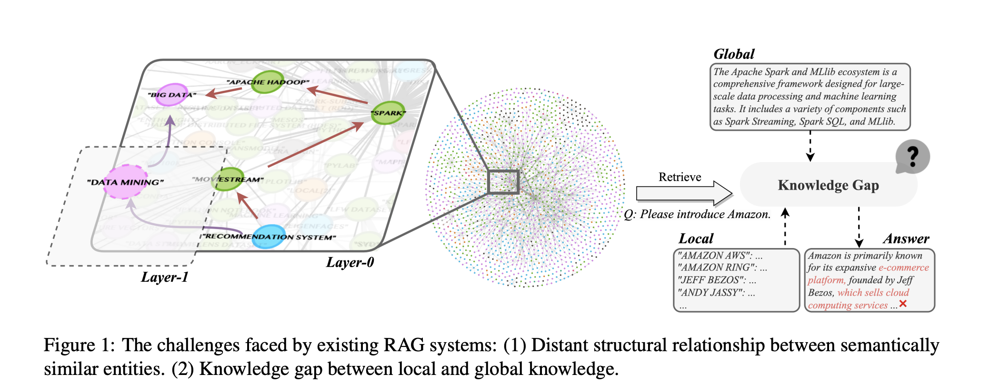
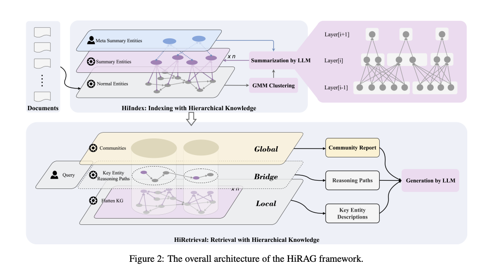
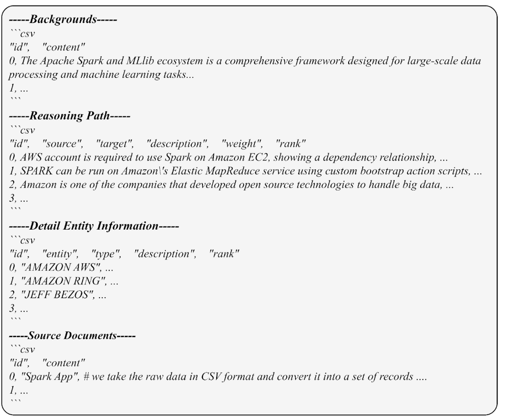
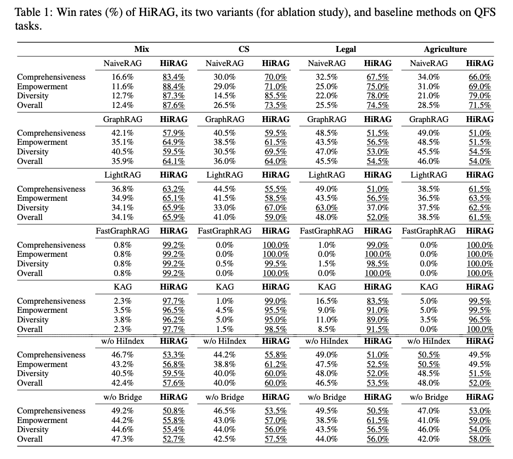
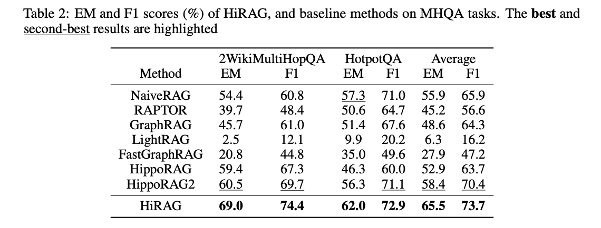
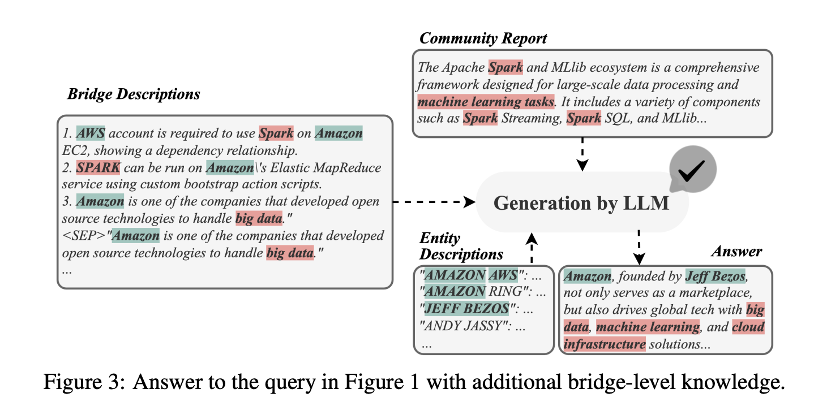
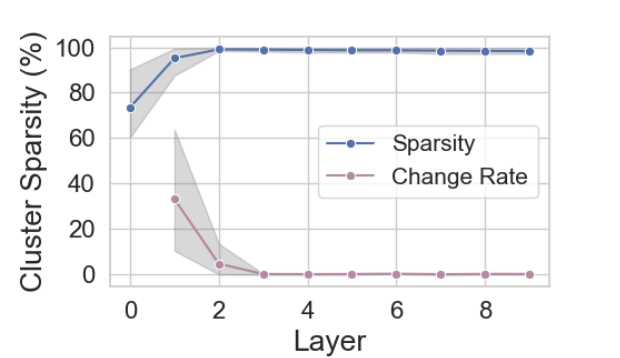
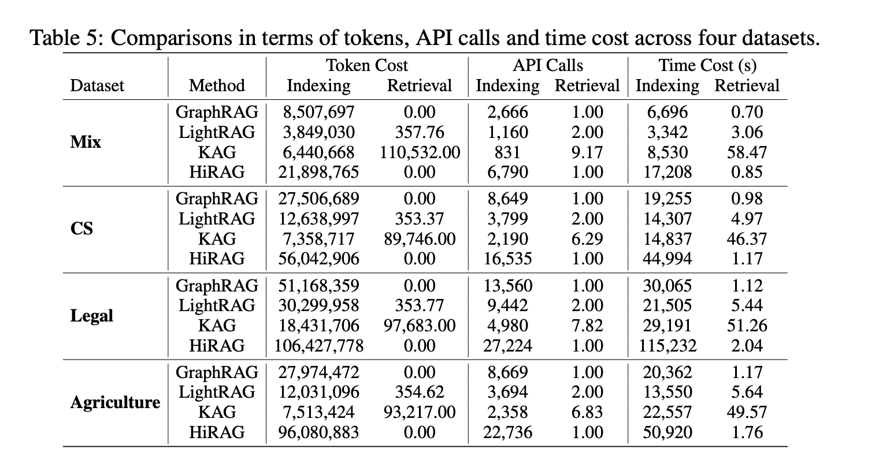

# 公众号文章参考
https://mp.weixin.qq.com/s/fVAhVh7btS37oHWYGaiD0Q
https://mp.weixin.qq.com/s/WrgzycTYmwm3E3SpU9Fwww
https://mp.weixin.qq.com/s/KNybPbT5cCMo3Sqen5eQvw

# HiRAG：突破知识鸿沟，让AI回答更全面、更准确
在当今AI快速发展的时代，大语言模型展现出了令人惊叹的能力。然而，当我们深入使用这些AI助手时，往往会发现它们的回答要么过于片面，要么缺乏逻辑连贯性。

为此，今天我们将为大家介绍一篇探索AI知识获取与应用新范式的论文——[HiRAG](https://arxiv.org/abs/2503.10150)。这篇论文提出了一种层次化知识检索增强生成方法，致力于解决当前AI系统在知识运用上的局限。接下来，我们将从问题的源起、方法的设计到实验验证，系统地展开讨论这项创新性工作。

## 1. 源起

### 一个关于亚马逊的提问引发的思考

想象这样一个场景：

James正想了解一下全球科技巨头AWS的情况，他打开了最新的AI助手，输入了一个看似简单的问题：**"请介绍一下亚马逊。"**

屏幕上迅速出现了回答：

> "亚马逊是全球最大的电子商务平台之一，由杰夫·贝索斯于1994年创立。公司以网上书店起家，现已发展成为全方位的线上零售商，提供从图书到电子产品、家居用品等几乎所有消费品类。亚马逊Prime会员服务为用户提供快速配送和流媒体娱乐内容..."

内容看似全面，但James皱起了眉头。作为一家市值曾超过万亿美元的科技巨头，亚马逊的AWS云服务业务贡献了公司大部分利润，却几乎没有在回答中得到重点提及。他尝试追问：**"亚马逊在云计算领域的地位如何？"**

AI助手这次给出了完全不同的叙述角度：

> "亚马逊网络服务(AWS)是全球领先的云计算平台，占据约32%的全球市场份额，远超微软Azure和谷歌Cloud。AWS为亚马逊贡献了超过70%的运营利润..."

James更困惑了：**"这是同一家公司吗？为什么前后描述如此割裂？"**

他继续提问：**"亚马逊的整体商业生态是什么样的？"**

AI再次回答，这次将前两次的内容简单拼接，但逻辑跳跃，缺乏有机联系，甚至在一些细节上出现了微妙的矛盾。

这个场景或许你也曾经历过。当今的AI助手虽然拥有海量知识，却常常无法像人类一样自然地"融会贯通"。它们或者提供过于片面的观点，或者生成看似全面但实则缺乏内在逻辑连贯性的回答。

### 为什么会这样？

表面上看，这是AI理解能力的局限。但深入思考，问题的根源可能在于AI获取和组织知识的方式。即使是当前最先进的检索增强生成(RAG)系统，也面临着知识组织和检索的两大挑战：

1. 如何连接语义相关但在知识结构中相距较远的信息？
2. 如何同时兼顾宏观视角(亚马逊是科技巨头)和微观细节(具体业务数据)？

人类思考问题时能够自然地在不同层次的知识间切换，将碎片化信息整合成有机整体。而AI系统要实现这一点，需要突破现有的平面知识表示方法，建立更接近人类认知的层次化知识结构。

这正是我们提出**HiRAG**(层次化知识检索增强生成)的初衷...

### 从Naive RAG到GraphRAG：现有方案及其局限

为了解决AI系统的知识检索问题，研究人员提出了一系列解决方案。最基础的是检索增强生成（Retrieval-Augmented Generation，RAG）方法[1]，它通过检索与查询相关的文本片段作为参考，来帮助语言模型生成回答，有效缓解了"幻觉"问题。然而，这种简单的文本匹配方式往往忽视了知识片段之间的关联关系。

为了捕捉知识之间的结构化关系，研究者们提出了基于图的检索增强生成（GraphRAG）方法[2]。GraphRAG通过构建知识图谱来模型化文档中实体之间的关系，并使用Leiden算法进行社区发现，从而在检索时能同时获取相关的上下文信息。这种基于图结构的方法开启了新的研究方向，催生了一系列改进方案（如表1所示），但这些方法仍然存在一些根本性的局限。

但这些方法仍然存在两个关键问题：

1. **结构距离与语义相关性的矛盾**：
   - 在知识图谱中，语义相关的实体可能因为文档结构的原因被放置在远离的位置
   - 例如，如图1所示，"BIG DATA"（大数据）和"RECOMMENDATION SYSTEM"（推荐系统）这两个在"DATA MINING"（数据挖掘）领域密切相关的概念，虽然在语义上高度相关，但在知识图谱的结构中却相距较远

2. **局部知识与全局知识的割裂**：
   - 检索到的具体实体（如业务数据）与其所属的更广泛概念（如技术领域）之间缺乏有效连接；这导致系统难以同时兼顾细节信息和宏观理解，无法提供连贯且全面的回答
   - 例如，当被问到"介绍亚马逊"时，系统检索到的局部知识（如"AMAZON AWS"、"AMAZON RING"等具体产品）与全局知识（Apache Spark和MLlib生态系统）之间存在断层，无法有效地将具体业务与整体技术生态联系起来

这些局限性启发我们思考：如何构建一个既能保持知识间自然关联，又能实现多层次信息整合的检索系统？

图1：现有检索增强系统知识处理的两大挑战

| 方法 | 索引方式 | 检索方式 | 挑战1：结构距离 | 挑战2：知识鸿沟 | 局限性 |
|------|----------|----------|-----------------|-----------------|---------|
| GraphRAG | 图增强的实体和关系抽取 + 基于Leiden算法的社区聚类 | 检索社区报告（全局搜索）和实体描述（局部搜索） | ❌ 仅考虑结构距离 | ❌ 检索全局或局部知识，但缺乏二者间的连接 | 缺乏语义连接 |
| LightRAG | 图增强的实体和关系抽取 | 基于查询的低层次和高层次关键词的双层检索 | ❌ 仅考虑知识图谱中的局部关系 | ⚠️ 通过低层次和高层次关键词部分解决 | 缺乏语义连接 |
| FastGraphRAG | 基于个性化PageRank的索引 | 仅通过向量搜索检索实体描述 | ❌ 仅考虑知识图谱中的局部关系 | ❌ 仅检索局部知识 | 缺乏全局知识和跨层次语义 |
| KAG | 依赖领域专家使用人工标注模式 | 集成逻辑形式引导的混合求解和推理引擎 | ⚠️ 使用人工标注模式的知识图谱 | ⚠️ 概念语义推理 | 需要大量人工标注 |
| HiRAG | 构建具有不同层次知识的层次化知识图谱 | 高效的三级知识检索 | ✅ 层次化知识图谱连接相似实体 | ✅ 桥接级知识填补鸿沟 | 🎯 同时解决两个挑战 |

## 2. 人类思维的启发

面对James关于亚马逊的提问，一个经验丰富的分析师会如何回答？他们通常会自然地运用层次化思维方式：

### 层次化认知的优势

人类在处理复杂信息时，会不自觉地构建一个多层次的知识体系：
- 在**宏观层面**，理解亚马逊是一家以技术创新为驱动的全球科技巨头
- 在**中观层面**，认识到其核心业务包括电商、云计算、人工智能等多个领域
- 在**微观层面**，能够具体讲解AWS的服务类型、Prime会员的权益等细节

### 知识连接的自然性

更重要的是，人类可以自如地在这些层次之间切换：
- 谈到AWS时，自然联想到云计算行业的整体发展
- 提到电商业务，能够联系到数据中心、物流网络的支持
- 讨论具体产品时，可以解释其与公司战略的关联

### 对AI系统的启示

人类的这种层次化认知方式给我们带来了重要启示：
- AI系统也应该建立类似的知识层次结构
- 需要在不同抽象层次的知识之间建立有机联系
- 检索系统要能够灵活地在不同层次间进行切换

这些思考为我们设计HiRAG系统提供了重要指导...

## 3. HiRAG：层次化知识检索增强生成

图2：HiRAG框架的整体架构

如图2所示，HiRAG框架包含两个核心模块：HiIndex和HiRetrieval。HiIndex负责构建层次化知识图谱，通过实体聚类和LLM摘要生成，将底层实体逐步抽象为更高层的概念。每一层的知识通过语义关联形成有机整体，构成了一个从具体到抽象的知识金字塔结构。

HiRetrieval则实现了三级检索策略：从底层的实体描述（Local），到中间层的推理路径（Bridge），再到顶层的社区知识（Global）。这种层次化的检索机制能够同时获取细节信息和宏观背景，并通过推理路径将不同层次的知识有机地连接起来，最终由LLM整合生成连贯的回答。

接下来我们将会具体介绍HiRAG的技术细节，从问题定义开始，然后依次讲解Hi-Index, Hi-Retrieval和协同工作机制
### 3.1 问题定义

在形式化定义中，HiRAG框架 $\mathcal{M}$ 由三个核心组件构成：

$\mathcal{M} = (LLM, \mathcal{R}(\varphi, \psi))$

其中：
- $LLM$ 是生成模块
- $\mathcal{R}$ 表示检索模块
- $\varphi$ 是图索引器
- $\psi$ 是图检索器

对于输入查询 $q$，最优答案 $a^*$ 的生成过程可以表示为：

$a^* = \arg\max_{a\in A} \mathcal{M}(a|q, \mathcal{G})$

其中 $\mathcal{G}$ 是从原始文档 $\mathcal{D}$ 构建的图数据库：

$\mathcal{G} = \varphi(\mathcal{D}) = \{(h,r,t)|h,t \in \mathcal{V}, r \in \mathcal{E}\}$

### 3.2 HiIndex：构建层次化知识图谱

HiIndex模块通过三个关键步骤构建层次化知识结构：

1. **基础知识图谱构建**
   - 使用实体中心的三元组抽取技术构建基础知识图谱 $\mathcal{G}_0$：
     $\mathcal{G}_0 = \{(h,r,t)|h,t \in \mathcal{V}_0, r \in \mathcal{E}_0\}$
   - 将输入文档分割成重叠的文本块，用于实体和关系抽取
   - 通过LLM生成实体间的初始关系，形成基础层（Layer-0）

2. **层次化知识聚合**
   - 获取第 $i-1$ 层实体的嵌入表示：
     $\mathcal{Z}_{i-1} = \{Embedding(v)|v \in \mathcal{L}_{i-1}\}$
   - 采用高斯混合模型进行语义聚类：
     $\mathcal{C}_{i-1} = GMM(\mathcal{L}_{i-1}, \mathcal{Z}_{i-1}) = \{S_1,\ldots,S_c\}$
   - 利用LLM为每个聚类生成摘要实体，更新知识图谱：
     $\mathcal{E}_i = \mathcal{E}_{i-1} \cup \mathcal{E}_{(i-1,i)}$
     $\mathcal{V}_i = \mathcal{V}_{i-1} \cup \mathcal{L}_i$

3. **多层次知识整合**
   - 使用预定义元概念集合 $\mathcal{X}$ 指导LLM生成摘要
   - 通过Leiden算法发现知识社区 $\mathcal{P}$
   - 构建层间连接：$\mathcal{G}_i = \{(h,r,t)|h,t \in \mathcal{V}_i, r \in \mathcal{E}_i\}$

### 3.3 HiRetrieval：三级知识检索策略

HiRetrieval模块实现了基于层次化知识的检索机制：

1. **局部知识检索**
   - 基于语义相似度选择Top-n相关实体：
     $\hat{\mathcal{V}} = TopN(\{v \in \mathcal{V}_k|Sim(q,v)\}, n)$
   - 提取实体的详细描述和属性信息
   - 计算查询与实体的语义相关度：$Sim(q,v)$

2. **全局知识获取**
   - 识别相关知识社区：$\hat{\mathcal{P}} = \bigcup_{p\in\mathcal{P}} \{p|\hat{\mathcal{V}} \cap p \neq \emptyset\}$
   - 生成社区级别的概述报告
   - 构建社区间的语义关联

3. **桥接知识构建**
   - 计算最短语义路径：
     $\mathcal{R} = \bigcup_{i\in[1,|\hat{\mathcal{V}}_p|-1]} ShortestPath_{\mathcal{G}}(\hat{\mathcal{V}}_p[i], \hat{\mathcal{V}}_p[i+1])$
   - 提取路径上的三元组：
     $\hat{\mathcal{R}} = \{(h,r,t) \in \mathcal{G}_k|h,t \in \mathcal{R}\}$

如图3所示，我们以"介绍Apache Spark在AWS上的应用"为例，展示HiRetrieval的三级检索过程：

图3：Hi-Retrieval检索回内容的示例

1. **局部知识检索**：系统首先识别出核心实体，如"Apache Spark"、"AWS"等，并获取它们的详细信息。从Detail Entity Information中可以看到，系统提取了与AWS相关的具体实体描述。

2. **全局知识获取**：从Backgrounds部分可以看到，系统检索到了Spark生态系统的整体介绍，这提供了问题的宏观背景。

3. **桥接知识构建**：在Reasoning Path部分，系统构建了一条完整的推理路径：
   - AWS账户是在EC2上使用Spark的必要条件
   - Spark可以通过Amazon的Elastic MapReduce服务运行
   - Amazon开发开源技术用于处理大数据
   这条路径清晰地展示了AWS和Spark之间的技术关联。

通过这种层次化的检索方式，系统不仅能够提供具体的技术细节，还能解释技术之间的关联性，使得回答更加全面和连贯。

### 3.4 协同工作机制

两个模块的协同通过以下方式实现：

1. **自适应检索深度**
   - 动态调整检索层次 $k$ 
   - 优化目标：$\max_{k} Score(Response(q, \mathcal{G}_k))$

2. **多维度知识融合**
   - 知识整合函数：$\mathcal{M}(a|q,\mathcal{G}) = \sum_{G\in\mathcal{G}} LLM(a|q,G)\cdot\psi(G|q,\mathcal{G})$
   - 确保生成的回答既有宏观视角，又有具体支撑

通过这种形式化的层次化知识组织和检索方式，HiRAG能够在理论保证的基础上，实现灵活和准确的知识检索与生成。

## 4. 实验证明的技术优势

### 4.1 跨域一致性优势

我们通过两种评估方式全面验证了HiRAG的性能优势：

1. **查询聚焦总结任务(QFS)**：在四个领域数据集（Mix、CS、Legal、Agriculture）上，使用GPT-4o作为评判模型，采用win rate指标进行多维度评估。win rate表示一个方法生成的答案被评为优于另一方法的百分比，评估维度包括：
   - **全面性(Comprehensiveness)**：答案是否全面覆盖问题的所有相关方面和细节
   - **赋能性(Empowerment)**：答案是否提供可操作的洞察或解决方案
   - **多样性(Diversity)**：答案是否包含多种视角、方法或解决方案
   - **整体表现(Overall)**：综合考虑上述三个维度的全面评估

2. **多跳问答(MHQA)任务**：在2WikiMultiHopQA和HotpotQA数据集上，使用精确匹配率(EM)和F1分数等客观指标进行评估。

两种评估方法在不同类型的任务上均显示HiRAG具有一致且显著的性能优势。

#### Win Rate全面领先

图4：HiRAG与其他基线方法在Query-Focused Summmarization数据集上的对比

- **显著全面优势**：
  - 对比NaiveRAG：HiRAG在整体表现上的win rate达到87.6%（Mix）、73.5%（CS）、74.5%（Legal）和71.5%（Agriculture），平均提升6.8%
  - 对比GraphRAG：在所有数据集上平均win rate达到59.2%，在全面性和赋能性方面优势尤为显著
  - 对比FastGraphRAG和KAG：以接近100%的win rate完全压制，这两个方法在全面性和赋能性方面尤其缺乏
  
- **多维度突出表现**：
  - **全面性方面**：HiRAG在Mix数据集上对比NaiveRAG的win rate高83.4%，证明其能提供更全面的知识解释
  - **赋能性方面**：在Mix数据集上对比NaiveRAG的win rate高88.4%，显示其能提供更有价值和可操作性的解答
  - **多样性方面**：在Legal和Agriculture数据集上的多样性得分分别达到78.0%和79.0%，表明其能提供多角度视角
  
<!-- - **融合层次化知识的价值**：消融实验（w/o HiIndex和w/o Bridge）显示，移除层次化索引或桥接知识后，性能显著下降，平均win rate分别降至55.8%和56.1% -->

#### EM和F1分数评估
- **客观指标突破**：在2WikiMultiHopQA数据集上，HiRAG的EM（精确匹配）分数达到**69.0%**，F1分数达到**74.4%**；在HotpotQA上，EM达到**62.0%**，F1分数为**72.9%**，平均性能（EM=65.5%，F1=73.7%）远超其他方法
- **显著领先优势**：相比次优方法HippoRAG2，HiRAG在平均EM指标上提升约**12.2%**，F1指标上提升约**4.7%**，证明了其在处理复杂问答任务上的卓越能力
- **多跳推理能力**：在需要连接多个知识片段的复杂推理问题上，HiRAG表现出明显优势，显示了其在构建完整知识路径方面的能力

图5：HiRAG与其他基线方法在多跳问答数据集上的EM和F1分数对比

### 4.2 有效性分析

我们通过消融研究和深入分析，验证了HiRAG两个核心组件的有效性。如图4所示，

#### HiIndex vs. 平面知识图谱
- 层次化结构的重要性：为评估层次化知识图谱的重要性，我们将其替换为平面知识图谱（基础KG），称为"w/o HiIndex"。实验表明，与完整的HiRAG相比，w/o HiIndex在几乎所有情况下性能都有所下降，且在至少一半的情况下降幅明显。这项消融研究表明，层次化索引在提升答案生成质量方面发挥着重要作用，因为它增强了语义相似实体之间的连接性，使相关实体能够从结构和语义两个维度进行有效分组。
- HiRetrieval的独立价值：从表1的数据来看，即使在平面知识图谱上，w/o HiIndex的win rate也优于或可比于GraphRAG和LightRAG。这表明我们的三层知识检索方法（HiRetrieval）即使应用在平面图谱上也很有效，因为GraphRAG和LightRAG虽然也基于平面图谱，但它们只使用局部实体描述和全局社区报告，而w/o HiIndex额外使用了桥接层知识。

#### HiRetrieval vs. 缺失知识
- 桥接知识的关键作用：为了展示HiRetrieval的有效性，我们创建了一个不使用桥接层知识的HiRAG变体，称为"w/o Bridge"。实验结果表明，没有桥接层知识时，win rate在所有数据集和评估维度上都显著下降，这是因为在局部层级知识和全局层级知识之间存在知识鸿沟，正如第1节所讨论的。我们在附录H中还报告了桥接层描述的知识覆盖率，进一步证明了局部和全局层级知识在桥接层描述中得到了良好连接。
- 案例研究：图3展示了用作LLM回答图1中查询的三层级知识背景。桥接层知识包含来自不同社区的实体描述，如图3中不同颜色所示，这帮助LLM正确回答关于亚马逊作为电子商务和云服务提供商角色的问题。

图6：Bridge层知识有效性的例证

### 4.3 层数自动确定与系统限制

### 确定层数

HiIndex中的一个重要问题是确定层次化知识图谱的层数 $k$，这应该根据每一层聚类的质量动态确定。当大多数聚类只包含少量实体时，我们停止构建新的层，这意味着实体无法再被有效地分组在一起。为了衡量这一点，我们引入了**聚类稀疏度**（cluster sparsity）$CS_i$ 的概念，灵感来自于图稀疏度，用于度量第 $i$ 层聚类的质量，如公式17所示：

$$CS_i = 1 - \frac{\sum_{S\in C_i} |S|(|S| - 1)}{|L_i|(|L_i| - 1)}.$$

$C_i$ 中的聚类包含的实体越少，$CS_i$ 的值越大，最坏情况是当每个聚类只包含一个实体时（即 $CS_i = 1$）。图7显示，随着层数增加，聚类稀疏度先增加后趋于稳定。我们还绘制了从 $CS_i$ 到 $CS_{i+1}$ 的变化率，这表明在构建一定数量的层后，几乎没有太多变化。我们设定阈值 $\epsilon = 5\%$，当聚类稀疏度的变化率低于 $\epsilon$ 时停止构建新层，因为此时聚类质量几乎没有或没有提升。
<!--  -->

图7：聚类稀疏度 CSi 和从 CSi 到 CSi+1 的变化率，其中阴影区域表示四个数据集的取值范围

### 4.4 成本与效率分析
为了评估HiRAG的效率和成本，如图8所示：虽然HiRAG为了获得更好的性能需要更多时间和资源来进行索引，但我们强调索引是离线进行的，使用DeepSeek-V3对Mix数据集的总成本仅约7.55美元。在检索方面，与KAG和LightRAG不同，HiRAG在检索阶段不消耗任何token。因此，HiRAG在在线检索方面更加高效。

图8：成本与效率分析

## 5. 实际应用场景与价值
- 金融行业：复杂信息的多层次理解与决策支持
- 医疗领域：从症状到诊断的层次化推理
- 法律咨询：法条细节与法律原则的统一理解
- 科研文献分析：连接具体实验结果与理论框架

## 6. 总结与展望
- 技术突破的意义：从平面知识到层次化知识的范式转变
- 研究团队介绍：KASMA.ai和香港中文大学的合作
- 开源代码与社区建设：GitHub链接及邀请读者参与
- 未来研究方向：基于实验结果提出的改进方向

## 7. 互动环节
- 案例讨论：分享您使用AI助手时遇到的"知识鸿沟"问题
- 技术问答：我们如何应用HiRAG解决您关心的特定场景问题
- 扫码关注：了解更多前沿AI研究进展
